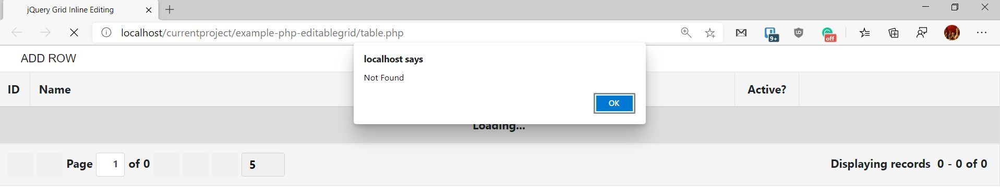

# Example PHP Inline Editable Grid with Mysql
It is an example of an inline editable grid, using PHP and MySQL


This example uses jQuery, Ajax and a library called Gijgo 


## 1- Configuring Composer.

For this exercise, we need composer installed and running (also PHP and MySQL)

Initialize composer as follow.


```shell
composer init
Welcome to the Composer config generator

This command will guide you through creating your composer.json config.

Package name (<vendor>/<name>) [jorge/example-php-editablegrid]: eftec/example-php-editablegrid
Description []: It is an tutorial to create an editable grid with php and mysql
Minimum Stability []:
Package Type (e.g. library, project, metapackage, composer-plugin) []: project
License []: MIT

Define your dependencies.

Would you like to define your dependencies (require) interactively [yes]?
Search for a package: eftec/bladeone
Enter the version constraint to require (or leave blank to use the latest version):
Using version ^3.43 for eftec/bladeone
Search for a package: eftec/pdoone
Enter the version constraint to require (or leave blank to use the latest version):
Using version ^1.37 for eftec/pdoone
Search for a package:
Would you like to define your dev dependencies (require-dev) interactively [yes]? no

Do you confirm generation [yes]?
Would you like the vendor directory added to your .gitignore [yes]?
Would you like to install dependencies now [yes]?
Loading composer repositories with package information
Updating dependencies (including require-dev)
Package operations: 2 installs, 0 updates, 0 removals

  - Installing eftec/bladeone (3.43): Loading from cache
  - Installing eftec/pdoone (1.37): Loading from cache
    eftec/bladeone suggests installing eftec/bladeonehtml (Extension to create forms)
    eftec/pdoone suggests installing eftec/validationone (For keeping and storing the messages)
    Writing lock file
    Generating autoload files


```

We will also use the next libraries **eftec/bladeone** and **eftec/pdoone**.


## 2 Creating tables

We need to create two tables on MySQL

### Country

Via code

```sql
CREATE TABLE country (
  `IdCounty` INT NOT NULL AUTO_INCREMENT,
  `Name` VARCHAR(45) NULL,
  PRIMARY KEY (`IdCounty`));
  
```

Or using an IDE


### Table players

Using script

```sql
CREATE TABLE `players` (
  `ID` INT NOT NULL AUTO_INCREMENT,
  `Name` VARCHAR(50) NULL,
  `IdCounty` INT NULL,
  `IsActive` INT NULL,
  PRIMARY KEY (`ID`),
  INDEX `players_fk_idx` (`IdCounty` ASC) VISIBLE,
  CONSTRAINT `players_fk`
    FOREIGN KEY (`IdCounty`)
    REFERENCES `country` (`IdCounty`)
    ON DELETE NO ACTION
    ON UPDATE NO ACTION);
    
    
```


## 3 Adding Data to the table

### Data to Country

```sql
INSERT INTO `country` (`IdCounty`, `Name`) VALUES ('1', 'USA');
INSERT INTO `country` (`IdCounty`, `Name`) VALUES ('2', 'Canada');
INSERT INTO `country` (`IdCounty`, `Name`) VALUES ('3', 'Mexico');
INSERT INTO `country` (`IdCounty`, `Name`) VALUES ('4', 'Portugal');

```


### Data to Players

```sql
INSERT INTO `players` (`ID`, `Name`, `IdCounty`, `IsActive`) VALUES ('1', 'Bryce Harper', '1', '1');
INSERT INTO `players` (`ID`, `Name`, `IdCounty`, `IsActive`) VALUES ('2', 'Manny Machado', '2', '0');
INSERT INTO `players` (`ID`, `Name`, `IdCounty`, `IsActive`) VALUES ('3', 'Carlos Correa', '1', '1');
INSERT INTO `players` (`ID`, `Name`, `IdCounty`, `IsActive`) VALUES ('4', 'Francisco Lindor,', '3', '1');
```

## 4 Creating the Repository Layer

The repository layer is classes that have functions to access the database, for example, insert,update, etc.

We want to create it automatically as follow.

Let's create this PHP file (in the root of the project)

```
<?php

use eftec\PdoOne;

include "vendor/autoload.php";

$pdo=new PdoOne('mysql','127.0.0.1','root','abc.123','example_editable_grid');
$pdo->logLevel=3;
$pdo->render();
```

where 127.0.0.1 is the server, root = user, abc.123 = password and example_editable_grid our base.

**loglevel**=3 is if something goes south then it will show the error.

And renders shows the next screen:


Add the next information.  Where it says "**input**", select the name of the table to generate (**country** or **players**)

For output, selects the option "**classcode**". It will generate our class.

Press generate and copy the result (is in **log**)

It will generate the next code

```php
<?php
/** @noinspection PhpUnused */

use eftec\PdoOne;
use eftec\_BasePdoOneRepo;


class CountryRepo extends _BasePdoOneRepo
{
   const TABLE = 'country';
   // .... more code

}
```

Copy this code and save in a folder (in my case I will use the folder **repo**)

Repeats the same procedure with all the tables.

## 5 Views

In the folder views, create the next file 📄 views/table.blade.php

It also uses a web service called 📁 ws/server.php **that it does not exists yet but we will create it later.**

 📄 views/table.blade.php

```html
<!DOCTYPE html>
<html>
<head>
    <title>jQuery Grid Inline Editing</title>
    <meta charset="utf-8" />
    <link rel="stylesheet" href="https://stackpath.bootstrapcdn.com/bootstrap/4.1.3/css/bootstrap.min.css" integrity="sha384-MCw98/SFnGE8fJT3GXwEOngsV7Zt27NXFoaoApmYm81iuXoPkFOJwJ8ERdknLPMO" crossorigin="anonymous">
    <script src="https://code.jquery.com/jquery-3.3.1.min.js"></script>
    <script src="https://unpkg.com/gijgo@1.9.13/js/gijgo.js" type="text/javascript"></script>
    <link href="https://unpkg.com/gijgo@1.9.13/css/gijgo.css" rel="stylesheet" type="text/css" />
</head>
<body>
<div class="container-fluid">
    <button id="btnAdd" class="gj-button-md">Add Row</button>
    <div class="row">
        <div class="col-xs-12">
            <table id="grid"></table>
        </div>
    </div>
</div>
<script type="text/javascript">
    $(document).ready(function () {
        let grid, countries;
        grid = $('#grid').grid({
            dataSource: 'ws/server.php?action=get',
            uiLibrary: 'bootstrap4',
            primaryKey: 'ID',
            inlineEditing: { mode: 'command' },
            columns: [
                { field: 'ID', width: 44 },
                { field: 'Name', editor: true },
                { field: 'CountryName', title: 'Nationality', type: 'dropdown', editField: 'IdCounty'
                    , editor: { dataSource: 'ws/server.php?action=countries', valueField: 'IdCounty', textField:'Name' } },
                { field: 'IsActive', title: 'Active?', type: 'checkbox', editor: true, width: 90, align: 'center' }
            ],
            pager: { limit: 5 }
        });
        grid.on('rowDataChanged', function (e, id, record) {
            // Clone the record in new object where you can format the data to format that is supported by the backend.
            const data = $.extend(true, {}, record);
            // Format the date to format that is supported by the backend.

            // Post the data to the server
            $.ajax({ url: 'ws/server.php?action=save', data: { record: data }, method: 'POST' })
                .done(function (e) {
                    if(e.result===false) {
                        alert(e.message);
                    }
                })
                .fail(function () {
                    alert('Failed to save.');
                });
        });
        grid.on('rowRemoving', function (e, $row, id, record) {
            if (confirm('Are you sure?')) {
                $.ajax({ url: 'ws/server.php?action=delete', data: { id: id }, method: 'POST' })
                    .done(function (e) {
                        if(e.result===false) {
                            alert(e.message);
                        }
                        grid.reload();
                    })
                    .fail(function () {
                        alert('Failed to delete.');
                    });
            }
        });
        $("#btnAdd").on("click",function() {
            $.ajax({url: 'ws/server.php?action=add', data: {}, method: 'POST'})
                .done(function (e) {
                    if(e.result===false) {
                        alert(e.message);
                    }
                    grid.reload();
                })                
                .fail(function () {
                    alert('Failed to insert.');
                })
        });
    });
</script>
</body>
</html>
```

## 6 Our webpage

It is our code page. It doesn't do much (yet) but later you could add some code. This code will call our view (created in the previous step)

 📄 /table.php

```php
<?php

use eftec\bladeone\BladeOne;

include "vendor/autoload.php";

$blade=new BladeOne();


echo $blade->run('table',[]);
```

## 7 And let's run

:-|



Ok, it is a start but it misses the web services mentioned in the step 5.

## 8 Creating web service.

Create a new PHP file called 📄 ws/server.php with the next content.

📄 ws/server.php

```php
<?php /** @noinspection ForgottenDebugOutputInspection */

use eftec\PdoOne;

header('Content-Type: application/json');

include '../vendor/autoload.php';
include '../repo/CountryRepo.php';
include '../repo/PlayersRepo.php';

$pdoOne=new PdoOne('mysql','127.0.0.1','root','abc.123','example_editable_grid');
$pdoOne->logLevel=3;
try {
    $pdoOne->connect();
} catch (Exception $e) {
    var_dump($e->getMessage());
    die(1);
}

$action=@$_GET['action'];

//$countries=CountryRepo::toList();
//var_dump($countries);

switch ($action) {
    case 'add':
        $record=PlayersRepo::factoryNull(); // we create an empty array
    
        try {
            PlayersRepo::insert($record);
            $result=['result'=>true];
        } catch (Exception $e) {
            $result=['result'=>false,'message'=>$e->getMessage()];
        }
        echo json_encode($result);
        break;
    case 'save':
        $record=$_POST['record'];
        unset($record['CountryName']); // we delete the field countryname
        $record['IsActive']=($record['IsActive'])?1:0; // we convert isactive(boolean) to 1 or 0.
        try {
            PlayersRepo::update($record);
            $result=['result'=>true];
        } catch (Exception $e) {
            $result=['result'=>false,'message'=>$e->getMessage()];
        }
        
        echo json_encode($result);
        break;
    case 'delete':
        $id=$_POST['id'];
        try {
            PlayersRepo::deleteById($id);
            $result=['result'=>true];
        } catch (Exception $e) {
            $result=['result'=>false,'message'=>$e->getMessage()];
        }
        
        echo json_encode($result);
        break;
    case 'get':
        $r=[];
        try {
            $r['records'] = $pdoOne->select('ID,Players.Name,Country.Name as CountryName,IsActive')->from('Players')
                                   ->left('Country on Players.IdCounty=Country.IdCounty')->toList();
        } catch (Exception $e) {
            $result=['result'=>false,'message'=>$e->getMessage()];
        }
        $r['total']=count($r['records']);
        echo json_encode($r);
        break;
    case 'countries':
        try {
            $result = CountryRepo::toList();
        } catch (Exception $e) {
            $result=['result'=>false,'message'=>$e->getMessage()];
        }
        echo json_encode($result);
        break;
    default:
        echo json_encode(['result'=>false,'message'=>'???? '.$action]);
}
```

What it does? I will explain:

### 8.1 Connecting to the database

The first part of the code, connects to the database. In error, it dumps the error.  You should change the information of the database such as user, password, etc.

```php
$pdoOne=new PdoOne('mysql','127.0.0.1','root','abc.123','example_editable_grid');
$pdoOne->logLevel=3;
try {
    $pdoOne->connect();
} catch (Exception $e) {
    var_dump($e->getMessage());
    die(1);
}
$action=@$_GET['action'];
```

It also reads the argument of the URL called action, i.e. **ws/server.php?action=somevalue**

### 8.2 Inserting

For inserting, we create an empty array and we use the class **PlayersRepo** (created automatically)

```php
$record=PlayersRepo::factoryNull();
PlayersRepo::insert($record);
```

### 8.3 Listing

Listing the countries. We use the class **CountryRepo**. We could also sort, paging and filtering.

```php
$result = CountryRepo::toList(); // select * from country
```

Listing the players. We need a custom query so we create directly (without the Repository layer). It is because we need all the columns of players but also the name of the country.

```php
        $r['records'] = $pdoOne->select('ID,Players.Name,Country.Name as CountryName,IsActive')->from('Players')
                               ->left('Country on Players.IdCounty=Country.IdCounty')->toList();
```
### 8.4 Update and delete

We update with an array with all the columns. For delete, we only need the primary key.

```php
PlayersRepo::update($record);

PlayersRepo::deleteById($id);
```

## 9 Let's run

Execute the same page than step 7 and it is the final result. If something fails, then you could check the error with your browser (KEY F12)


